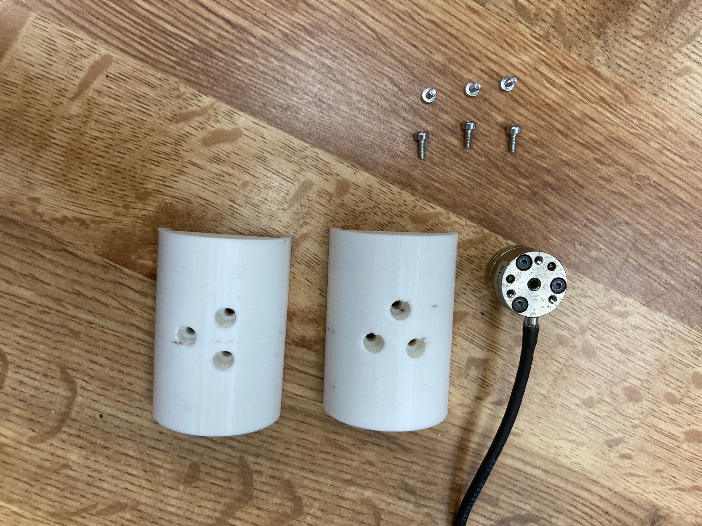
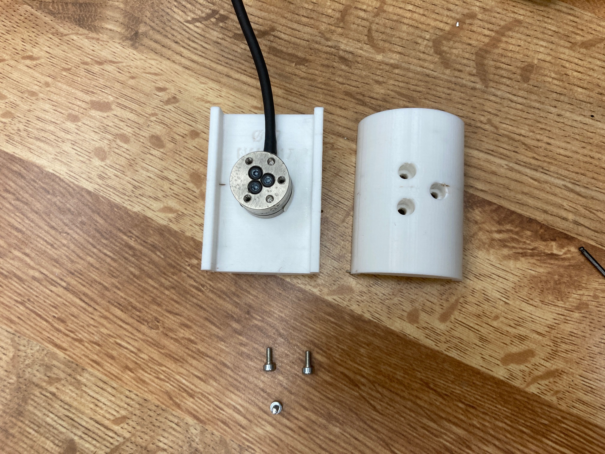
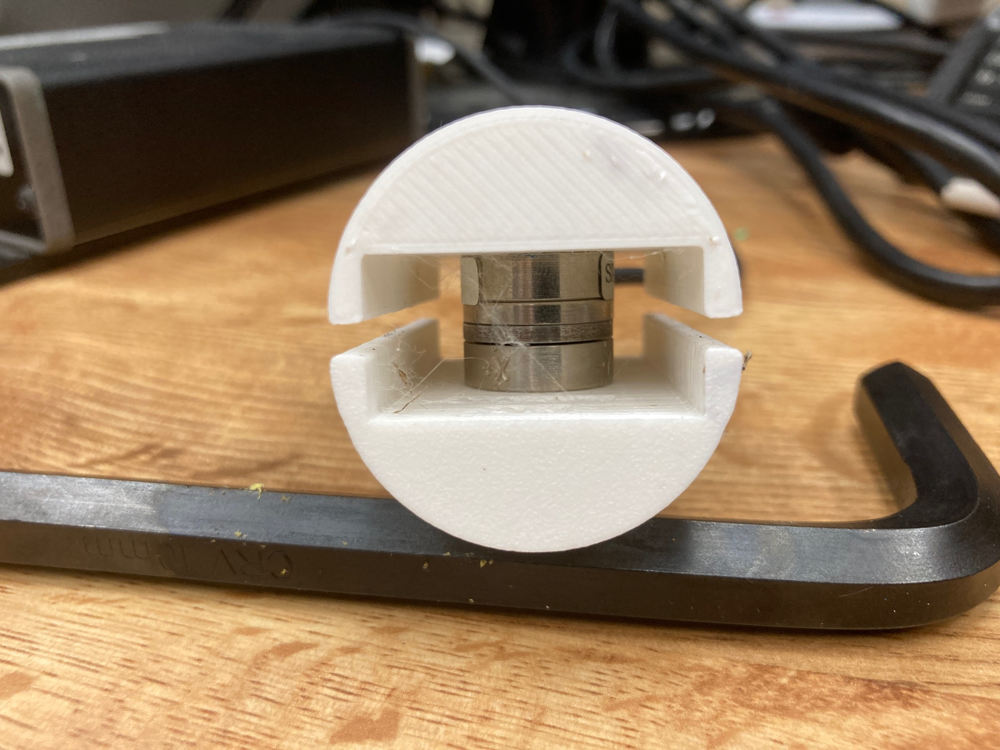

# Shells for ASTM Grasp Strength of Robotic Hands
3D models of shells for standardized objects compatible with ATI-IA MINI45 and NANO17 force sensors.

Instructions:<br>
Simply print the desired shells with your favorite 3d printing machine. Fine layers are recommended (0.1-0.2 mm). No support material required, see AllShells_3DPrinting.3mf

NANO17 18mm Shell Assembly:<br>
Assemble all components, use 6 M2x5 socket head screws.<br>
<br>
Attach first half shell with 3 screws. ```diff
- DO NOT OVERTIGHTEN THE SCREWS! ``` You can damage the force sensors if excessive torque is applied.<br>
<br>
Attach second half shell with 3 screws. AGAIN DO NOT OVERTIGHTEN THE SCREWS!<br>
<br>
Finished!<br>

MINI45 52mm Shell Assembly:<br>
Assemble all components, use 12 M3x8 socket head screws.<br>


Required:<br>
M2x5 socket head screws: https://www.mcmaster.com/91292A005/<br>
M3x8 socket head screws: https://www.mcmaster.com/91292A112/

Optional:<br>
Schedule 40 PVC pipe 2-3/8" diameter: https://www.mcmaster.com/49035K48/<br>
Schedule 40 PVC pipe 3-1/2" diameter: https://www.mcmaster.com/49035K49/<br>
one roll of clear scotch tape 

###  DISCLAIMER:
The files of this project are provided "as is", and at your own risk. Under no circumstances shall any author be liable for direct, indirect, special, incidental, or consequential damages resulting from the use, misuse, or inability to use these files, even if the authors have been advised of the possibility of such damages.
